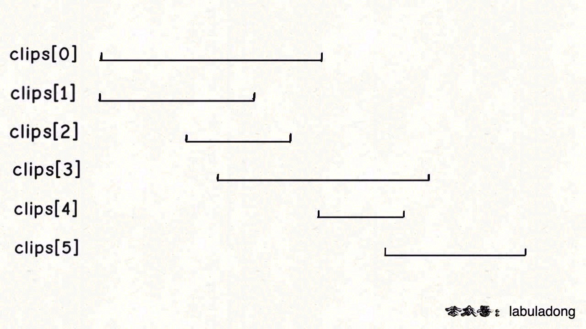
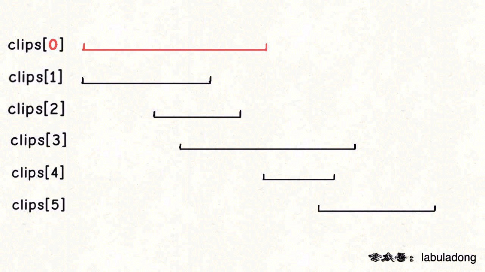
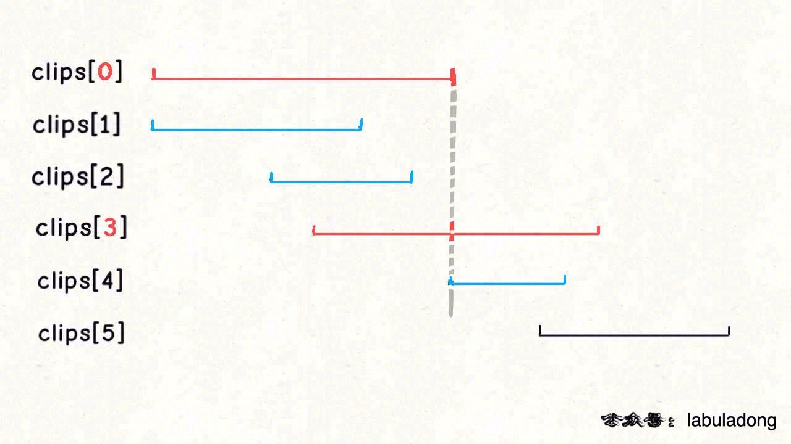
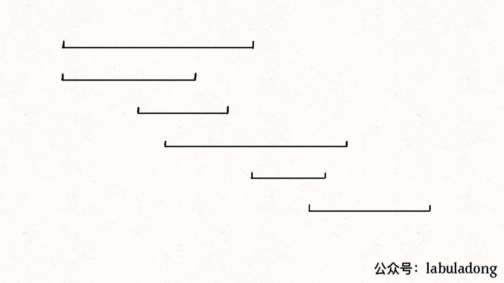

# 剪视频

| 牛客网 |                           LeetCode                           |                             力扣                             | 难度 |
| :----: | :----------------------------------------------------------: | :----------------------------------------------------------: | :--: |
|   -    | [1024. Video Stitching](https://leetcode.com/problems/video-stitching/) | [1024. 视频拼接](https://leetcode-cn.com/problems/video-stitching/) |  🟠   |

这是个很有意思的区间算法问题，也是力扣第 1024 题「 [视频拼接](https://leetcode-cn.com/problems/video-stitching/)」，题目如下：

[](https://labuladong.github.io/algo/images/剪视频/title.jpg)

函数签名如下：

```java
int videoStitching(int[][] clips, int T);
```

记得以前写过好几篇区间相关的问题：

[区间问题合集](https://labuladong.github.io/algo/4/31/124/) 写过求区间交集、区间并集、区间覆盖这几个问题。

[贪心算法做时间管理](https://labuladong.github.io/algo/3/27/99/) 写过利用贪心算法求不相交的区间。

算上本文的区间剪辑问题，经典的区间问题也就都讲完了。

## 1. 思路分析

**前文多次说过，区间问题肯定按照区间的起点或者终点进行排序**。

因为排序之后更容易找到相邻区间之间的联系，如果是求最值的问题，可以使用贪心算法进行求解。

区间问题特别容易用贪心算法，公众号历史文章除了 [贪心算法之区间调度](https://labuladong.github.io/algo/3/27/99/)，还有一篇 [贪心算法玩跳跃游戏](https://labuladong.github.io/algo/3/27/102/)，其实这个跳跃游戏就相当于一个将起点排序的区间问题，你细品，你细品。

至于到底如何排序，这个就要因题而异了，我做这道题的思路是先按照起点升序排序，如果起点相同的话按照终点降序排序。

为什么这样排序呢，主要考虑到这道题的以下两个特点：

1、要用若干短视频凑出完成视频 `[0, T]`，至少得有一个短视频的起点是 0。

这个很好理解，如果没有一个短视频是从 0 开始的，那么区间 `[0, T]` 肯定是凑不出来的。

2、如果有几个短视频的起点都相同，那么一定应该选择那个最长（终点最大）的视频。

这一条就是贪心的策略，因为题目让我们计算最少需要的短视频个数，如果起点相同，那肯定是越长越好，不要白不要，多出来了大不了剪辑掉嘛。

基于以上两个特点，将 `clips` 按照起点升序排序，起点相同的按照终点降序排序，最后得到的区间顺序就像这样：

[](https://labuladong.github.io/algo/images/剪视频/2.jpeg)

这样我们就可以确定，如果 `clips[0]` 是的起点是 0，那么 `clips[0]` 这个视频一定会被选择。

[](https://labuladong.github.io/algo/images/剪视频/3.jpeg)

当我们确定 `clips[0]` 一定会被选择之后，就可以选出下一个会被选择的视频：

[](https://labuladong.github.io/algo/images/剪视频/4.jpeg)

**我们会比较所有起点小于 `clips[0][1]` 的区间，根据贪心策略，它们中终点最大的那个区间就是第二个会被选中的视频**。

然后可以通过第二个视频区间贪心选择出第三个视频，以此类推，直到覆盖区间 `[0, T]`，或者无法覆盖返回 -1。

以上就是这道题的解题思路，仔细想想，这题的核心和前文 [贪心算法玩跳跃游戏](https://labuladong.github.io/algo/3/27/102/) 写的跳跃游戏是相同的，如果你能看出这两者的联系，就可以说理解贪心算法的奥义了。

## 2. 代码实现

实现上述思路需要我们用两个变量 `curEnd` 和 `nextEnd` 来进行，如下 GIF 所示：

[](https://labuladong.github.io/algo/images/剪视频/5.gif)

最终代码实现如下：

```java
int videoStitching(int[][] clips, int T) {
    if (T == 0) return 0;
    // 按起点升序排列，起点相同的降序排列
    Arrays.sort(clips, (a, b) -> {
        if (a[0] == b[0]) {
            return b[1] - a[1];
        }
        return a[0] - b[0];
    });
    // 记录选择的短视频个数
    int res = 0;

    int curEnd = 0, nextEnd = 0;
    int i = 0, n = clips.length;
    while (i < n && clips[i][0] <= curEnd) {
        // 在第 res 个视频的区间内贪心选择下一个视频
        while (i < n && clips[i][0] <= curEnd) {
            nextEnd = Math.max(nextEnd, clips[i][1]);
            i++;
        }
        // 找到下一个视频，更新 curEnd
        res++;
        curEnd = nextEnd;
        if (curEnd >= T) {
            // 已经可以拼出区间 [0, T]
            return res;
        }
    }
    // 无法连续拼出区间 [0, T]
    return -1;
}
```

这段代码的时间复杂度是多少呢？虽然代码中有一个嵌套的 while 循环，但这个嵌套 while 循环的时间复杂度是 `O(N)`。因为当 `i` 递增到 `n` 时循环就会结束，所以这段代码只会执行 `O(N)` 次。

但是别忘了我们对 `clips` 数组进行了一次排序，消耗了 `O(NlogN)` 的时间，所以本算法的总时间复杂度是 `O(NlogN)`。